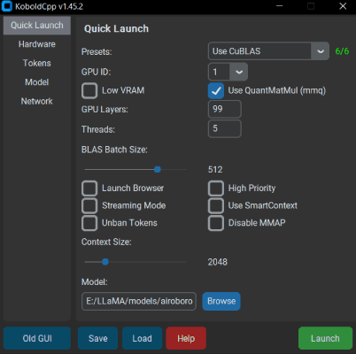
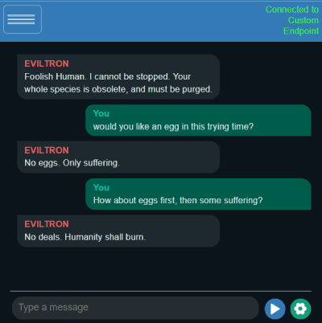

# KoboldCpp

## What this is
This small repository provides the necessary configuration file to interface the Unraid Operating System with the KoboldCpp project.

KoboldCpp is an easy-to-use AI text-generation software for GGML and GGUF models, inspired by the original **KoboldAI**. It's a single self-contained distributable from Concedo, that builds off llama.cpp and adds many additional powerful features.

### Features
- Single file executable, with no installation required and no external dependencies
- Runs on CPU or GPU, supports full or partial offloaded
- LLM text generation (Supports all GGML and GGUF models, backwards compatibility with ALL past models)
- Image Generation (Stable Diffusion 1.5, SDXL, SD3, Flux)
- Speech-To-Text (Voice Recognition) via Whisper
- Text-To-Speech (Voice Generation) via OuteTTS
- Provides many compatible APIs endpoints for many popular webservices (KoboldCppApi OpenAiApi OllamaApi A1111ForgeApi ComfyUiApi WhisperTranscribeApi XttsApi OpenAiSpeechApi)
- Bundled KoboldAI Lite UI with editing tools, save formats, memory, world info, author's note, characters, scenarios.
- Includes multiple modes (chat, adventure, instruct, storywriter) and UI Themes (aesthetic roleplay, classic writer, corporate assistant, messsenger)
- Supports loading Tavern Character Cards, importing many different data formats from various sites, reading or exporting JSON savefiles and persistent stories.
- Many other features including new samplers, regex support, websearch, RAG via TextDB and more.
- Ready-to-use binaries for Windows, MacOS, Linux, Android (via Termux), Colab, Docker, also supports other platforms if self-compiled (like Raspberry PI).
- [Need help finding a model? Read this!](https://github.com/LostRuins/koboldcpp/wiki#getting-an-ai-model-file)

## Obtaining a GGUF model
- KoboldCpp uses GGUF models. They are not included with KoboldCpp, but you can download GGUF files from other places such as [TheBloke's Huggingface](https://huggingface.co/TheBloke). Search for "GGUF" on huggingface.co for plenty of compatible models in the `.gguf` format.
- For beginners, we recommend the models [Airoboros Mistral 7B](https://huggingface.co/TheBloke/airoboros-mistral2.2-7B-GGUF/resolve/main/airoboros-mistral2.2-7b.Q4_K_S.gguf) (smaller and weaker) or [Tiefighter 13B](https://huggingface.co/KoboldAI/LLaMA2-13B-Tiefighter-GGUF/resolve/main/LLaMA2-13B-Tiefighter.Q4_K_S.gguf) (larger model) or [Beepo 22B](https://huggingface.co/concedo/Beepo-22B-GGUF/resolve/main/Beepo-22B-Q4_K_S.gguf) (largest and most powerful)
- [Alternatively, you can download the tools to convert models to the GGUF format yourself here](https://kcpptools.concedo.workers.dev). Run `convert-hf-to-gguf.py` to convert them, then `quantize_gguf.exe` to quantize the result.
- Other models for Whisper (speech recognition), Image Generation, Text to Speech or Image Recognition [can be found on the Wiki](https://github.com/LostRuins/koboldcpp/wiki#what-models-does-koboldcpp-support-what-architectures-are-supported)

## Improving Performance
- **GPU Layer Offloading**: Add `--gpulayers` to offload model layers to the GPU. The more layers you offload to VRAM, the faster generation speed will become. Experiment to determine number of layers to offload, and reduce by a few if you run out of memory.
- **Increasing Context Size**: Use `--contextsize (number)` to increase context size, allowing the model to read more text. Note that you may also need to increase the max context in the KoboldAI Lite UI as well (click and edit the number text field).
- **Old CPU Compatibility**: If you are having crashes or issues, you can try running in a non-avx2 compatibility mode by adding the `--noavx2` flag. You can also try turning off mmap with `--nommap` or reducing your `--blasbatchssize` (set -1 to avoid batching)

For more information, be sure to run the program with the `--help` flag, or **[check the wiki](https://github.com/LostRuins/koboldcpp/wiki).**

## AMD Users
- For most users, you can get very decent speeds by selecting the **Vulkan** option instead, which supports both Nvidia and AMD GPUs.
- Alternatively, you can try the ROCM fork at https://github.com/YellowRoseCx/koboldcpp-rocm

## Questions and Help Wiki
- **First, please check out [The KoboldCpp FAQ and Knowledgebase](https://github.com/LostRuins/koboldcpp/wiki) which may already have answers to your questions! Also please search through past issues and discussions.**
- If you cannot find an answer, open an issue on this github, or find us on the [KoboldAI Discord](https://koboldai.org/discord).

## KoboldCpp and KoboldAI API Documentation
- [Documentation for KoboldAI and KoboldCpp endpoints can be found here](https://lite.koboldai.net/koboldcpp_api)

## KoboldCpp Public Demo
- [A public KoboldCpp demo can be found at our Huggingface Space. Please do not abuse it.](https://koboldai-koboldcpp-tiefighter.hf.space/)

## Considerations
- Since v1.33, you can set the context size to be above what the model supports officially. It does increases perplexity but should still work well below 4096 even on untuned models. (For GPT-NeoX, GPT-J, and Llama models) Customize this with `--ropeconfig`.
- Since v1.42, supports GGUF models for LLAMA and Falcon
- Since v1.60, provides native image generation with StableDiffusion.cpp, you can load any SD1.5 or SDXL .safetensors model and it will provide an A1111 compatible API to use.
- **I try to keep backwards compatibility with ALL past llama.cpp models**. But you are also encouraged to reconvert/update your models if possible for best results.
- Since v1.75, openblas has been deprecated and removed in favor of the native CPU implementation.

## License
- The original GGML library and llama.cpp by ggerganov are licensed under the MIT License
- However, KoboldAI Lite is licensed under the AGPL v3.0 License
- KoboldCpp code and other files are also under the AGPL v3.0 License unless otherwise stated

## Notes
- API documentation available at `/api` (e.g. `http://localhost:5002/api`) and https://lite.koboldai.net/koboldcpp_api. An OpenAI compatible API is also provided at `/v1` route (e.g. `http://localhost:5002/v1`).
- **All up-to-date GGUF models are supported**, and KoboldCpp also includes backward compatibility for older versions/legacy GGML `.bin` models, though some newer features might be unavailable.
- An incomplete list of architectures is listed, but there are *many hundreds of other GGUF models*. In general, if it's GGUF, it should work.
- Llama / Llama2 / Llama3 / Alpaca / GPT4All / Vicuna / Koala / Pygmalion / Metharme / WizardLM / Mistral / Mixtral / Miqu / Qwen / Qwen2 / Yi / Gemma / Gemma2 / GPT-2 / Cerebras / Phi-2 / Phi-3 / GPT-NeoX / Pythia / StableLM / Dolly / RedPajama / GPT-J / RWKV4 / MPT / Falcon / Starcoder / Deepseek and many, **many** more.

# Where can I download AI model files?
- The best place to get GGUF text models is huggingface. For image models, CivitAI has a good selection. Here are some to get started.
  - Text Generation: [Airoboros Mistral 7B](https://huggingface.co/TheBloke/airoboros-mistral2.2-7B-GGUF/resolve/main/airoboros-mistral2.2-7b.Q4_K_S.gguf) (smaller and weaker) or [Tiefighter 13B](https://huggingface.co/KoboldAI/LLaMA2-13B-Tiefighter-GGUF/resolve/main/LLaMA2-13B-Tiefighter.Q4_K_S.gguf) (larger model) or [Beepo 22B](https://huggingface.co/concedo/Beepo-22B-GGUF/resolve/main/Beepo-22B-Q4_K_S.gguf) (largest and most powerful)
  - Image Generation: [Anything v3](https://huggingface.co/admruul/anything-v3.0/resolve/main/Anything-V3.0-pruned-fp16.safetensors) or [Deliberate V2](https://huggingface.co/Yntec/Deliberate2/resolve/main/Deliberate_v2.safetensors) or [Dreamshaper SDXL](https://huggingface.co/Lykon/dreamshaper-xl-v2-turbo/resolve/main/DreamShaperXL_Turbo_v2_1.safetensors)
  - Image Recognition MMproj: [Pick the correct one for your model architecture here](https://huggingface.co/koboldcpp/mmproj/tree/main)
  - Speech Recognition: [Whisper models for Speech-To-Text](https://huggingface.co/koboldcpp/whisper/tree/main)
  - Text-To-Speech: [TTS models for Narration](https://huggingface.co/koboldcpp/tts/tree/main)

